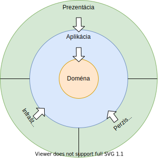

# Awesome App

Aplikacia sluzi ako demo s pouzitim Clean architektury, backend .NET Core 5.0, frontend ASP.NET Core a desktopova aplikacia pomocou Electron.NET.

Aplikacia implementuje nakupny zoznam.

## Core

Je centrom aplikacie s Clean architekturou, obsahuje triedy:

- entity
- agregacie
- domenove udalosti
- DTO triedy
- interface
- handlery udalosti
- specifikacie

Obsahuje domenove triedy a business logiku aplikacie. Core ma velmi malo externych zavislosti, vsetky ostatne komponenty zavisia na Core.




## Infrastructure

Obsahuje manazment externych zdrojov ako su databazy, suborovy system, externe servisy (API). Pouziva Entity Framework Core na pristup k databazam.

## SharedKernel

Pouziva sa ako oddeleny projekt s kodom zdielanym medzi roznymi bounded kontextmi (DDD metodologia). Obsahuje zakladne base triedy pre domenovu udalost, ValueObject a interface IRepository a IAggregateRoot.

## Web

Implementuje API endpointy ako aj weboveho klienta pomocou ASP.NET Core.

## Dektopovy klient

Pre desktopoveho klienta je pouzity projekt [Electron.NET](https://github.com/ElectronNET/Electron.NET), ktory zaobali ASP.NET Core webstranku do Electron aplikacie. Vyhodou je multi-platformove riesenie beziace na Win/macOS/Linux systemoch. Nevyhodou a riskom je relativne mala rozsirenost kniznice Electron.NET aj ked parametre githubu nie su az take nepriaznive (5.7k stars, 543 forks, 82 issues).

## Tests

Pouziva xunit, Moq a TestHost.

## Databaza

Aplikacia pouziva lokalnu sqlite databazu. Bohuzial som nestihol podporu inych databaz. Implementacia by potrebovala tri oddelene DbContext triedy, pre kazdu databazu. EF Core podporuje MySQL, MS SQL aj Oracle data providerov. Toto riesenie ma limitacie, napriklad nemoznost previazania databaz pomocou cudzich klucov ako aj absencia distribuovanych transakcii cez vsetky databazy.

## Spustenie

Webovy klient sa spusti:

``` cmd
cd src\AwesomeApp.Web
dotnet run
```

a otvorenim weboveho prehliadaca s adresou http://localhost:57679. Na adrese  http://localhost:57679/swagger je swagger dokumentacia k API.

Desktopovy klient sa spusti:

``` cmd
dotnet tool install ElectronNET.CLI -g
cd src\AwesomeApp.Web
electronize start
```

## Alternativne riesenie

Mozne zdokonalenie riesenia by bolo pouzit:
- Backend a API: .NET Core s Clean architekturou
- Front end webovy klient: Angular
- Front end desktopovy klient: Electron

Vyhodou by bolo robustnejsie riesenie, kedze ElectronNET pravdepodobne nebude riesenim do produkcneho prostredia.